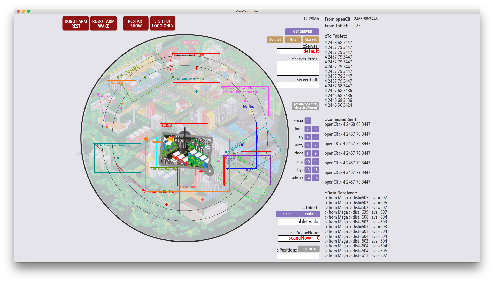

# Aum's Journey: An Interactive Robotic Art Installation

This project is the control plane for "Aum's Journey," an interactive robotic art installation that tells the true story of Aum, a man who found his way home after being lost for 15 years, using Google's voice search.

The system uses a Python application powered by the Gemini 2.5 Pro API. The AI acts as a "director," interpreting user prompts and using function calling to send serial commands to the physical hardware, orchestrating the narrative in real-time.

## System Architecture

The installation's hardware is managed by a multi-controller setup:

1.  **Python Control Plane (`main.py`)**: The central application that serves as the "brain" of the operation. It hosts the Gemini model, manages the user interaction, and sends commands to the appropriate microcontroller.
2.  **Robotic Arm Controller**: An OpenCR board running at `57600` baud, responsible for controlling a 3-axis robotic arm with Dynamixel motors.
3.  **Main Scene Controller**: An Arduino Mega running at `9600` baud, which acts as the master controller for the diorama's narrative scenes.
4.  **Secondary LED Controller**: A slave Arduino Mega that controls the main logo animation, triggered by digital pin signals from the Main Scene Controller.

### Original Controller Interface

The following screenshot shows the original `MainController` application that was used to operate the diorama. The logs and command structures visible here were used to reverse-engineer the control logic.



## The Director's Logic (`AUM_DIRECTOR.md`)

The `AUM_DIRECTOR.md` file serves as the master prompt and "show flow" for the Gemini model. It explicitly maps each narrative beat of Aum's story to a precise sequence of hardware actions by providing the AI with two Python functions to call: `trigger_diorama_scene` and `move_robotic_arm`. The coordinates and scene IDs used in this file were derived from the original software's logs and source code.

## Project Structure

-   **`main.py`**: The main entry point for the Python application.
-   **`AUM_DIRECTOR.md`**: The system prompt for the AI director.
-   **`AUM_STORY.md`**: The complete narrative of Aum's journey.
-   **`context/CodeContext.md`**: A detailed technical breakdown of the Arduino firmware.
-   **`requirements.txt`**: Lists the necessary Python dependencies.
-   **`.env.example`**: An example file for setting up your environment variables.
-   **`test_main.py`**: Unit tests for the application logic.
-   **`test_integration.py`**: An integration test that makes a live call to the Gemini API.

## Getting Started

1.  **Create your Environment File:**
    Rename the `.env.example` file to `.env` and add your specific configuration details.
    ```bash
    cp .env.example .env
    ```

2.  **Edit the `.env` file:**
    Open the `.env` file and fill in the required values.
    ```dotenv
    # Your Google AI API Key for accessing Gemini
    GEMINI_API_KEY="YOUR_API_KEY"

    # The serial port for the Main Scene Controller (Baud: 9600)
    MAIN_CONTROLLER_PORT="/dev/your_main_controller_port"

    # The serial port for the Robotic Arm Controller (Baud: 57600)
    ROBOTIC_ARM_PORT="/dev/your_robotic_arm_port"
    ```
    *To find your serial port names, run `ls /dev/tty.*` in your terminal before and after plugging in each device.*

3.  **Install Dependencies:**
    You will need to install Python dependencies as well as the `portaudio` library, which is required by `pyaudio`.

    **On macOS (using Homebrew):**
    ```bash
    brew install portaudio
    pip install -r requirements.txt
    ```

    **On Debian/Ubuntu:**
    ```bash
    sudo apt-get update
    sudo apt-get install libportaudio2
    pip install -r requirements.txt
    ```

4.  **Run the Application:**
    The application now runs a full-duplex audio loop. **It is highly recommended to use headphones** to prevent the model's spoken output from being fed back into the microphone.
    ```bash
    python main.py
    ```
    You may need to grant microphone access to your terminal application when you run it for the first time.