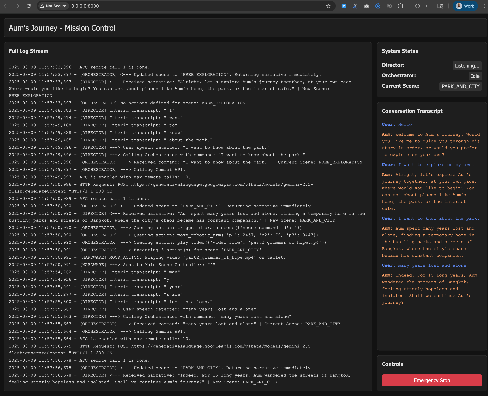

# Aum's Journey: An Interactive Robotic Art Installation
[](https://github.com/pauldatta/helloai2025-robot-revival/actions/workflows/python-tests.yml)

This project is the control plane for "Aum's Journey," an interactive robotic art installation that tells the true story of Aum, a man who found his way home after being lost for 15 years, using Google's voice search.

The system uses a voice-activated AI architecture powered by the Gemini API. A **Live Director** handles real-time conversation, passing the user's speech to a stateful **Orchestrator**. The Orchestrator determines the user's desired scene, generates a narrative, and triggers all corresponding hardware actions.

## System Architecture

The application's logic is decoupled into a voice interface, a control plane, and a hardware action map.

1.  **Live Director (`live_director.py`):** Captures the user's speech and acts as the text-to-speech engine for the AI's narrative. It is a pure voice interface.
2.  **Orchestrator (`orchestrator.py`):** The "brain" of the operation. It takes the user's speech, calls the Gemini API to determine the `next_scene`, and then executes all hardware actions associated with that scene.
3.  **Scene-to-Action Mapping (`orchestrator.py`):** A simple Python dictionary (`SCENE_ACTIONS`) maps scene names to a list of hardware commands. This decouples the AI from the hardware, making it incredibly easy to add new scenes or actions (e.g., video playback, smoke machines) without changing the AI's prompt or logic.


## Mission Control Web Interface

The project includes a real-time web interface for monitoring and control, accessible at `http://localhost:8000` when running the app. It provides a live log stream, a parsed conversation transcript, and a system status panel, all powered by a FastAPI backend with WebSockets.



## Project Structure

-   `src/`: Contains all the core Python source code.
-   `prompts/`: Holds the system prompt that defines the AI's storytelling and state-management behavior.
-   `tests/`: Contains unit tests.
-   `context/`: Contains story context, diagrams, and original hardware code.

## Customizing Scenes and Actions

The core of the installation's physical behavior is defined in the `SCENE_ACTIONS` dictionary, located at the top of the `src/orchestrator.py` file. This dictionary maps a narrative scene name to a sequence of hardware actions, making it easy to customize the experience without altering the core logic.

### Structure

Each scene is a key in the dictionary. Its value is a list of action objects, where each object has an `action` and `params` key.

```python
"SCENE_NAME": [
    {"action": "action_type_1", "params": {"param_a": "value_1"}},
    {"action": "action_type_2", "params": {"param_b": 123}},
]
```

### Available Actions

| Action                    | Description                                                                                                     | Parameters                                                              |
| ------------------------- | --------------------------------------------------------------------------------------------------------------- | ----------------------------------------------------------------------- |
| `trigger_diorama_scene`   | Sends a numeric ID to the main Arduino controller to trigger a specific, pre-programmed light and motor sequence. | `scene_command_id` (integer): The ID for the scene in the Arduino code. |
| `move_robotic_arm`        | Moves the robotic arm to a specific coordinate.                                                                 | `p1`, `p2`, `p3` (integers): The coordinates for the arm's position.      |
| `play_video`              | Plays a video file on the connected tablet. Video files are located in the `context/` directory.                  | `video_file` (string): The name of the video file.                      |

### Scene Aliasing

You can also make one scene an alias for another by setting its value to the string name of the target scene. This is useful for creating different narrative paths (like the guided mode) that reuse the same hardware actions.

```python
"GUIDED_MODE_AUMS_HOME": "AUMS_HOME",
```

This configuration makes the `GUIDED_MODE_AUMS_HOME` scene execute the same actions as the `AUMS_HOME` scene.

## Getting Started

### 1. Initial Setup

- **Install `socat`** (Required for Emulator Mode on macOS/Linux):
  - **macOS:** `brew install socat`
  - **Linux:** `sudo apt-get install socat`
- **Install Audio & Python Dependencies:**
  - **macOS:** `brew install portaudio`
  - **Linux:** `sudo apt-get install libportaudio2`
  - Then, install Python packages: `pip install -r requirements.txt`
- **Install Git Hooks:**
  - This will automatically format and lint your code before each commit.
    ```bash
    pre-commit install
    ```
- **Configure API Key:**
  - Copy `.env.example` to a new file named `.env`.
  - Edit `.env` and add your `GEMINI_API_KEY`.

### 2. Running the Application

#### Development (Emulator Mode)

For local development without physical hardware, the application runs in an emulated mode. This setup uses `socat` to create virtual serial ports.

1.  **Activate Virtual Environment:**
    ```bash
    source venv/bin/activate
    ```
2.  **Start Services with Foreman:**
    The `Procfile.dev` defines all the services needed for emulation: the web server, the hardware emulator, the virtual ports, and the main director application.
    ```bash
    foreman start -f Procfile.dev
    ```
    The web interface will be available at `http://localhost:8000`.

#### Production (with Hardware)

When running with the physical Arduino hardware, the application requires a different setup.

1.  **Configure Environment:**
    - Open your `.env` file.
    - Set the environment to production: `AUM_ENVIRONMENT="prod"`.
    - Connect your hardware and find the device paths (e.g., by running `ls /dev/tty.*` or `ls /dev/cu.*` on macOS).
    - Set the correct port paths for your hardware in the `.env` file (e.g., `MAIN_CONTROLLER_PORT="/dev/tty.usbmodem12345"` and `ROBOTIC_ARM_PORT="/dev/tty.usbmodemABCDE"`).

2.  **Run with Foreman (Recommended):**
    The `Procfile.prod` is configured to run the necessary processes for a production environment (the web server and the director). This is the standard way to run the application for deployment or production testing.
    ```bash
    source venv/bin/activate
    # Ensure AUM_ENVIRONMENT is set to "prod" in your .env file
    foreman start -f Procfile.prod
    ```

3.  **Run Manually (Alternative):**
    If you prefer not to use `foreman`, you can run the web server and the director in two separate terminal windows.

    - **Terminal 1: Start the Web Server**
      ```bash
      source venv/bin/activate
      uvicorn web.server:app --host 0.0.0.0 --port 8000
      ```
    - **Terminal 2: Start the Director**
      ```bash
      source venv/bin/activate
      python -m src.main
      ```

### 3. Running Tests
- To verify the application's logic, run the unit tests:
  ```bash
  source venv/bin/activate
  python -m unittest discover tests
  ```

## Research

Here are some resources that provide context and background for the story of Aum:

-   **The Story of Aum (Video):** [Watch on YouTube](https://www.youtube.com/watch?v=VBhLYy2LCjQ&t=1s)
-   **Google for Thailand Blog Post:** [Read on Google Blog](https://blog.google/around-the-globe/google-asia/googleforthailand/?utm_source=tw&utm_medium&utm_campaign=og)
-   **Across the Pond - Google Aum's Reunion:** [View the Case Study](https://acrossthepond.com/work/google-aums-reunion)
