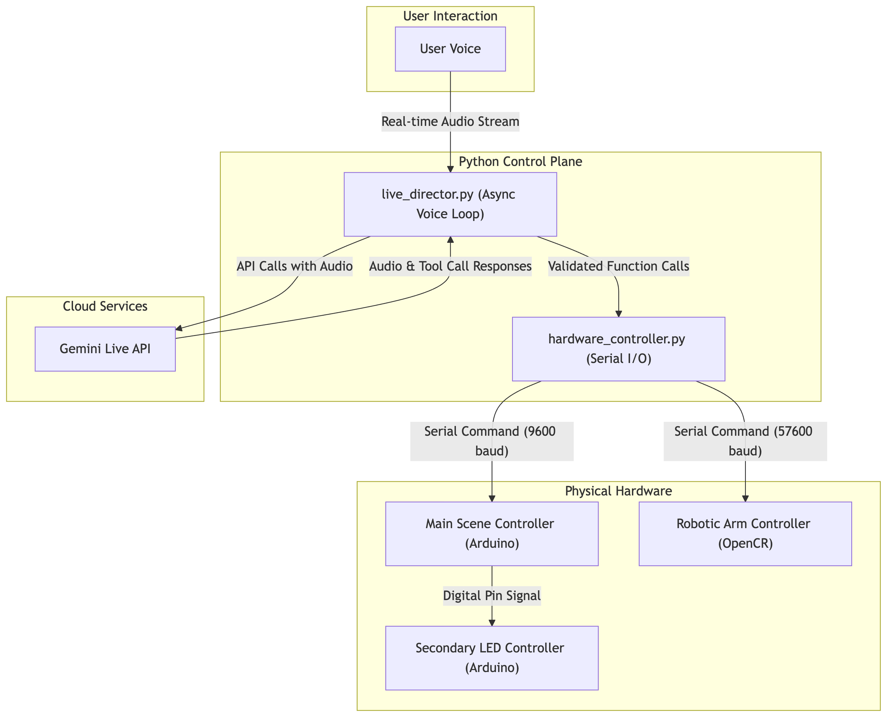

# Aum's Journey: An Interactive Robotic Art Installation

This project is the control plane for "Aum's Journey," an interactive robotic art installation that tells the true story of Aum, a man who found his way home after being lost for 15 years, using Google's voice search.

The system uses a Python application powered by the Gemini Live API. The AI acts as a "director," interpreting voice commands and using function calling to send serial commands to the physical hardware, orchestrating the narrative in real-time.

## System Architecture

The installation's hardware is managed by a multi-controller setup, orchestrated by the Python control plane.



## Modes of Operation

The application has two primary modes, determined by your `.env` configuration:

1.  **Emulator Mode (Default):** For development without physical hardware. If no port variables are set in your `.env` file, the application defaults to using a high-fidelity emulator managed by `foreman` via stable symlinks.
2.  **Hardware Mode:** For connecting to the physical Arduino and OpenCR boards. When you define `MAIN_CONTROLLER_PORT` and `ROBOTIC_ARM_PORT` in your `.env` file, the application will connect to the real hardware.

## Getting Started

### 1. First-Time Setup
- **Install `socat`** (Required for Emulator Mode):
  - **macOS:** `brew install socat`
  - **Linux:** `sudo apt-get install socat`
- **Install Audio & Python Dependencies:**
  - **macOS:** `brew install portaudio`
  - **Linux:** `sudo apt-get install libportaudio2`
  - Then, install Python packages: `pip install -r requirements.txt`

### 2. Running the Emulator (Default)
- Simply run `foreman` using the development Procfile. It will automatically create and use the virtual serial ports.
  ```bash
  source venv/bin/activate
  foreman start -f Procfile.dev
  ```
- **Note:** You do not need to configure any ports in your `.env` file for this mode. The application will default to the symlinks created by `foreman`.

### Example Emulator Log Output
When running correctly, you will see the `director` and `emulator` processes interacting. The director calls tools, and the emulator logs the commands it receives.

```
21:47:18 socat_main.1 | started with pid 39679
21:47:18 socat_arm.1  | started with pid 39680
21:47:18 emulator.1   | started with pid 39681
21:47:18 director.1   | started with pid 39682
21:47:18 socat_main.1 | 2025/08/08 21:47:18 socat[39679] N PTY is /dev/ttys002
21:47:18 socat_main.1 | 2025/08/08 21:47:18 socat[39679] N PTY is /dev/ttys004
21:47:18 socat_main.1 | 2025/08/08 21:47:18 socat[39679] N starting data transfer loop with FDs [5,5] and [7,7]
21:47:18 socat_arm.1  | 2025/08/08 21:47:18 socat[39680] N PTY is /dev/ttys019
21:47:18 socat_arm.1  | 2025/08/08 21:47:18 socat[39680] N PTY is /dev/ttys020
21:47:18 socat_arm.1  | 2025/08/08 21:47:18 socat[39680] N starting data transfer loop with FDs [5,5] and [7,7]
21:47:18 emulator.1   | --- Hardware Emulator Running ---
21:47:18 emulator.1   | This script simulates the physical Arduino and OpenCR boards.
21:47:18 emulator.1   | Run via 'foreman start -f Procfile.dev'
21:47:18 emulator.1   | Press Ctrl+C to exit.
21:47:18 emulator.1   | [ARM EMULATOR] Listening on ./robotic_arm_emu_port
21:47:18 emulator.1   | [SCENE EMULATOR] Listening on ./main_controller_emu_port
21:47:18 director.1   | Both GOOGLE_API_KEY and GEMINI_API_KEY are set. Using GOOGLE_API_KEY.
21:47:18 director.1   | Starting Aum's Journey Director...
21:47:18 director.1   | Use headphones to prevent audio feedback loops.
21:47:18 director.1   | Press Ctrl+C to exit.
21:47:19 director.1   | Microphone is open. Start speaking.
21:47:23 director.1   | --> Calling Tool: move_robotic_arm(p2=68, velocity=50, p1=2468, p3=3447, acceleration=5)
21:47:23 director.1   | [Robotic Arm Controller] Waiting for serial port './robotic_arm_app_port' to become available...
21:47:23 director.1   | Successfully connected to Robotic Arm Controller on port: ./robotic_arm_app_port
21:47:23 director.1   | DIRECTOR ACTION: Sent to Robotic Arm Controller: 3 50 50 50 5 5 5 2468 68 3447
21:47:23 emulator.1   | [ARM EMULATOR] Received command: '3 50 50 50 5 5 5 2468 68 3447'
21:47:23 emulator.1   | [ARM EMULATOR] Updated position to: [2468, 68, 3447]
21:47:23 director.1   | <-- Tool Result: Command '3 50 50 50 5 5 5 2468 68 3447' sent to Robotic Arm Controller.
21:47:23 director.1   | --> Calling Tool: trigger_diorama_scene(scene_command_id=2)
21:47:23 director.1   | [Main Scene Controller] Waiting for serial port './main_controller_app_port' to become available...
21:47:23 director.1   | Successfully connected to Main Scene Controller on port: ./main_controller_app_port
21:47:23 director.1   | DIRECTOR ACTION: Sent to Main Scene Controller: 2
21:47:23 emulator.1   | [SCENE EMULATOR] Received command: '2'
21:47:23 director.1   | <-- Tool Result: Command '2' sent to Main Scene Controller.
```

### 3. Running with Physical Hardware
1.  **Find Your Port Names:** Connect your hardware and find the device paths (e.g., by running `ls /dev/tty.*`).
2.  **Configure `.env`:**
    - Create a `.env` file (copy `.env.example`).
    - Define the two hardware port variables.
      ```dotenv
      GEMINI_API_KEY="YOUR_API_KEY_HERE"
      MAIN_CONTROLLER_PORT="/dev/tty.usbmodem14101"
      ROBOTIC_ARM_PORT="/dev/tty.usbmodem14201"
      ```
3.  **Run the Application:**
    - Start the main application directly (do not use `foreman`).
      ```bash
      source venv/bin/activate
      python main.py
      ```