# Aum's Journey: An Interactive Robotic Art Installation
[](https://github.com/pauldatta/helloai2025-robot-revival/actions/workflows/python-tests.yml)

This project is the control plane for "Aum's Journey," an interactive robotic art installation that tells the true story of Aum, a man who found his way home after being lost for 15 years, using Google's voice search.

The system uses a voice-activated AI architecture powered by the Gemini API. A **Live Director** handles real-time conversation, passing the user's speech to a stateful **Orchestrator**. The Orchestrator determines the user's desired scene, generates a narrative, and triggers all corresponding hardware actions.

## System Architecture

The application's logic is decoupled into a voice interface, a control plane, and a hardware action map.

1.  **Live Director (`live_director.py`):** Captures the user's speech and acts as the text-to-speech engine for the AI's narrative. It is a pure voice interface.
2.  **Orchestrator (`orchestrator.py`):** The "brain" of the operation. It takes the user's speech, calls the Gemini API to determine the `next_scene`, and then executes all hardware actions associated with that scene.
3.  **Scene-to-Action Mapping (`orchestrator.py`):** A simple Python dictionary (`SCENE_ACTIONS`) maps scene names to a list of hardware commands. This decouples the AI from the hardware, making it incredibly easy to add new scenes or actions (e.g., video playback, smoke machines) without changing the AI's prompt or logic.



## Project Structure

-   `src/`: Contains all the core Python source code.
-   `prompts/`: Holds the system prompt that defines the AI's storytelling and state-management behavior.
-   `tests/`: Contains unit tests.
-   `context/`: Contains story context, diagrams, and original hardware code.

## Getting Started

### 1. First-Time Setup
- **Install `socat`** (Required for Emulator Mode):
  - **macOS:** `brew install socat`
  - **Linux:** `sudo apt-get install socat`
- **Install Audio & Python Dependencies:**
  - **macOS:** `brew install portaudio`
  - **Linux:** `sudo apt-get install libportaudio2`
  - Then, install Python packages: `pip install -r requirements.txt`
- **Install Git Hooks:**
  - After installing the Python dependencies, activate the pre-commit hooks. This will automatically format and lint your code before each commit.
    ```bash
    pre-commit install
    ```
- **Configure API Key:**
  - Copy `.env.example` to a new file named `.env`.
  - Edit `.env` and add your `GEMINI_API_KEY`.

### 2. Running in Emulator Mode (for Development)
- The application runs in **emulator mode** by default when you use `foreman`.
  ```bash
  source venv/bin/activate
  foreman start -f Procfile.dev
  ```

### 3. Running in Production Mode (with Hardware)
1.  **Find Your Port Names:** Connect your hardware and find the device paths (e.g., by running `ls /dev/tty.*`).
2.  **Configure `.env`:**
    - Open your `.env` file.
    - Set the environment to production: `AUM_ENVIRONMENT="prod"`
    - Set the correct port paths for your hardware (e.g., `MAIN_CONTROLLER_PORT="/dev/tty.usbmodem12345"`).
3.  **Run the Application:**
    - Start the main application directly as a module from the project root.
      ```bash
      source venv/bin/activate
      python -m src.main
      ```

#### Using Foreman (for Production Deployment)
- If you are deploying to a platform that uses `Procfile`s (like Heroku), you can use the `Procfile.prod`.
  ```bash
  # Ensure AUM_ENVIRONMENT is set to "prod" in your environment variables
  foreman start -f Procfile.prod
  ```

### 4. Running Tests
- To verify the application's logic, run the unit tests:
  ```bash
  source venv/bin/activate
  python -m unittest discover tests
  ```
